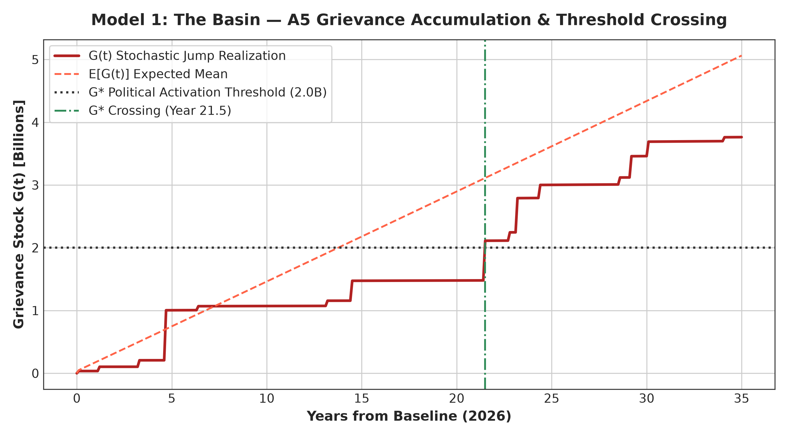
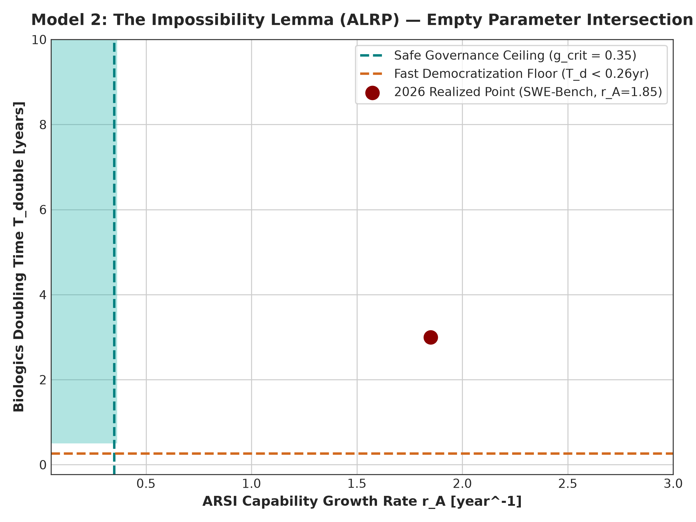
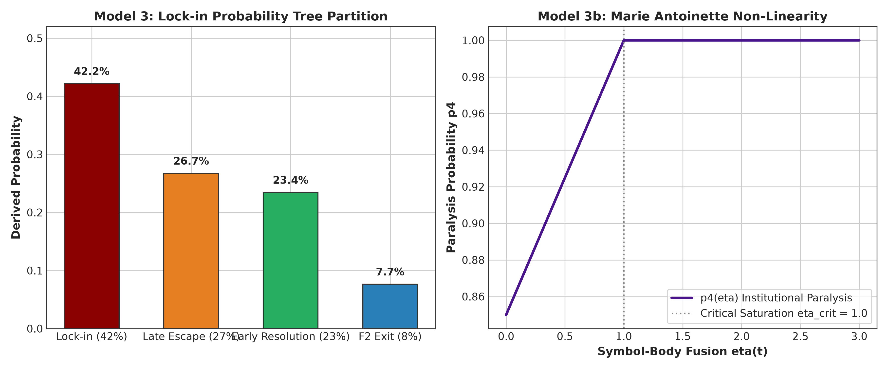
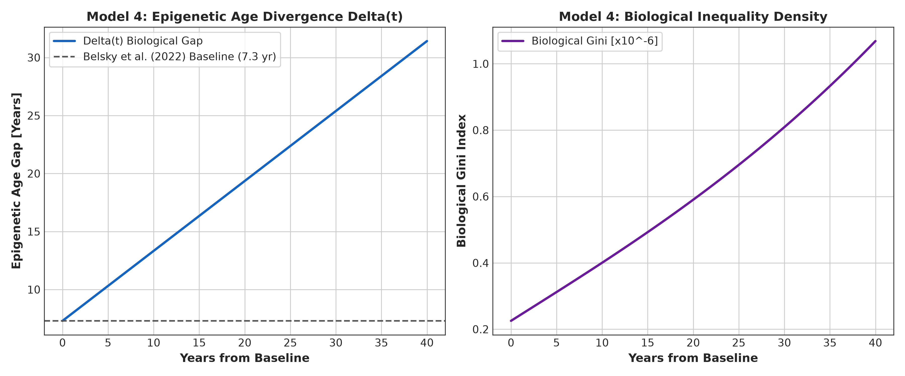
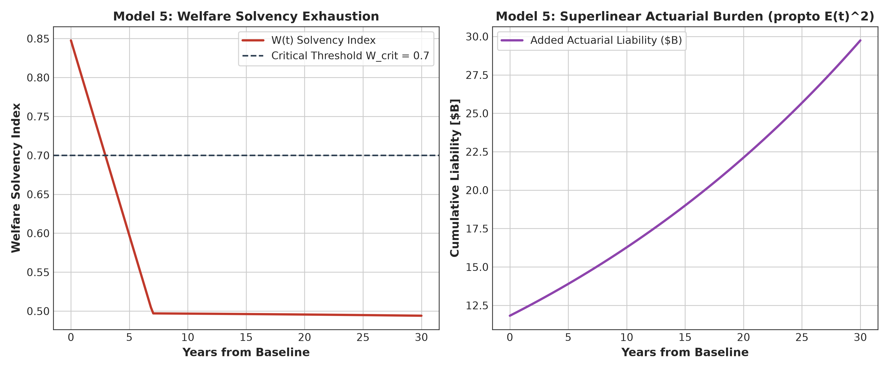
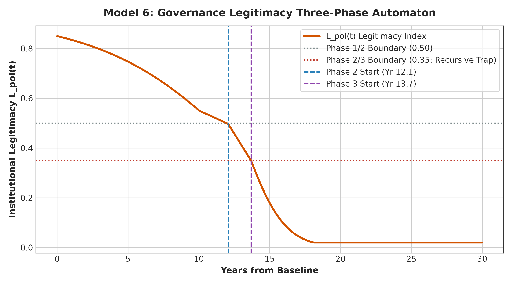
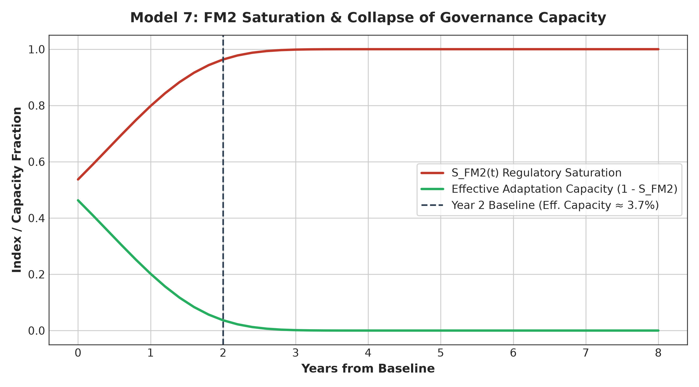
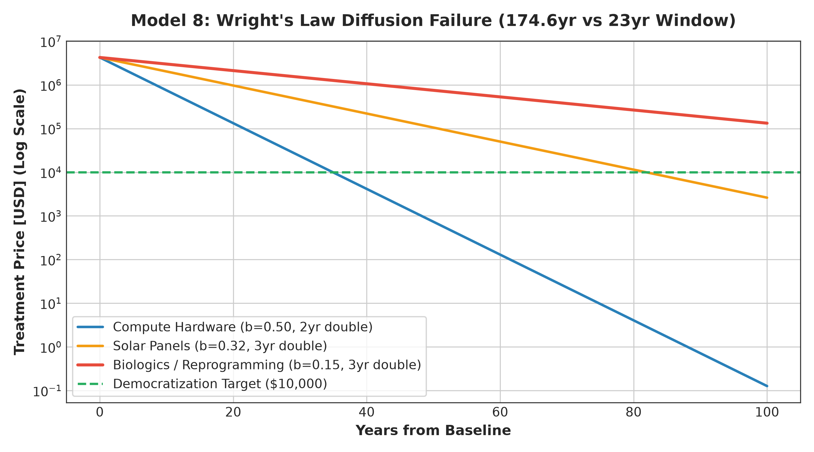
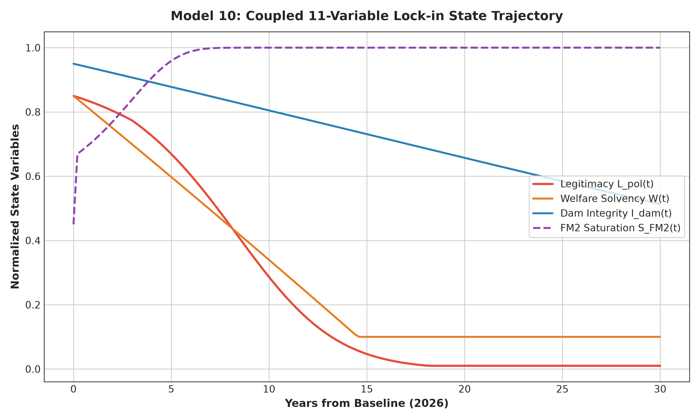
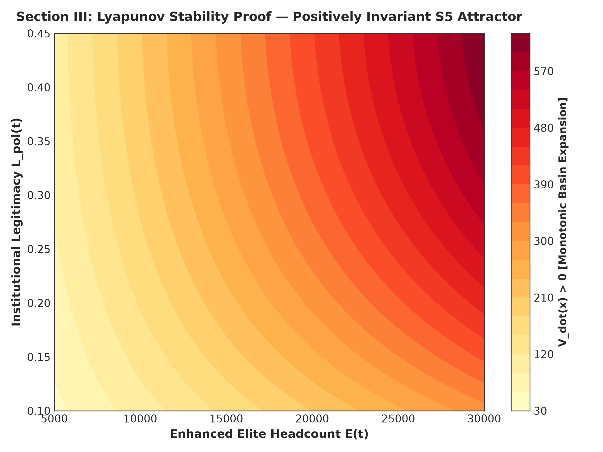

# The Mathematical Basin: Thirteen Formal Models of Longevity Asymmetry, Structural Lock-in, and Institutional Dissolution

[](https://opensource.org/licenses/MIT)
[](https://www.python.org/)
[](tests/)
[](https://orcid.org/0009-0008-2372-5852)
[](N2026_The_Mathematical_Basin_13Models.pdf)

**Author**: Gia Bao Huynh  
*Independent Researcher, Ho Chi Minh City, Vietnam*  
*Email*: huynhbao@asu.edu · *ORCID*: [0009-0008-2372-5852](https://orcid.org/0009-0008-2372-5852)  
*Research Stance*: **Challenging the unchecked power, epistemic asymmetries, and monopolized governance of non-state actors across frontier technologies.**  
*Collaborator*: Claude (Anthropic)  
*Monograph Source*: Chapter IX of *Till Death Tear Us Apart: A Structural Analysis of the Longevity Asymmetry and the Closing Window* (First Edition, June 2026).

---

## Executive Summary & Formal Thesis

This repository contains the complete mathematical and computational implementation of **The Thirteen Formal Models** established in Gia Bao Huynh (2026a). Organized around the empirical falsification of the **Mortality Symmetry Axiom (MSA)**—the historical condition under which biological lifespan was universal across social classes and unpurchasable by capital—this research program formalizes why AI-accelerated longevity technology is developing faster than existing governance institutions can absorb, and why all standard institutional exit pathways close by their own internal structural logic.

The formal structure is governed by three epistemic commitments:
1. **Non-Extrapolation ($P_5$)**: No claim extends beyond mechanisms currently operating, historical precedents with documented parameters, and premises empirically verified as of June 2026.
2. **Exhaustive Disjunction Elimination (Holmes Method)**: The logic is not merely probabilistic but eliminative—the space of exits ($F_1$ to $F_5$) has been partitioned, demonstrating that each exit's enabling condition is simultaneously its disabling condition.
3. **Five Interlocking Paradoxes as Load-Bearing Beams**:
   - **Governance Paradox (GP)**: Regulators have constitutive biological attachments that make impartial governance of life-extension structurally unavailable.
   - **Reform Acceleration Paradox (RAP)**: Partial reform makes residual asymmetry legible and intolerable, accelerating crisis rather than abating it.
   - **Generative Paradox (GenP)**: Organizational scale sufficient to challenge monopoly power inherits the structural incentives of monopoly power.
   - **Dam Paradox (DP)**: Mortality—the ultimate historical equalizer of concentrated power—is purchased before it can self-correct.
   - **ARSI-Longevity Resonance Paradox (ALRP)**: The acceleration required to democratize access is the exact acceleration that destabilizes governance.

---

## The Thirteen Formal Models

```
┌──────────────────────────────────────────────────────────────────────────────────────────────────┐
│                             THE MATHEMATICAL BASIN (13 FORMAL MODELS)                            │
└─────────────────────────────────┬────────────────────────────────────────────────────────────────┘
                                  │
         ┌────────────────────────┼────────────────────────┬────────────────────────┐
         ▼                        ▼                        ▼                        ▼
 ┌───────────────┐        ┌───────────────┐        ┌───────────────┐        ┌───────────────┐
 │   DRIVERS &   │        │ STRUCTURAL    │        │ INSTITUTIONAL │        │  TERMINAL &   │
 │   ASYMMETRY   │        │ IMPOSSIBILITY │        │ DISSOLUTION   │        │   STABILITY   │
 ├───────────────┤        ├───────────────┤        ├───────────────┤        ├───────────────┤
 │ M1: A5 Basin  │        │ M2: ALRP      │        │ M5: Actuarial │        │ M11: Dam Field│
 │ M4: Epigenetic│        │ M3: Tree Chain│        │ M6: 3-Phase   │        │ M12: Fractures│
 │ M9: Love Field│        │ M8: Wright F1 │        │ M7: FM2 Sat.  │        │ M13: Terminal │
 └───────────────┘        └───────────────┘        └───────────────┘        └───────┬───────┘
                                                                                    │
                                                                                    ▼
                                                                            ┌───────────────┐
                                                                            │  S5 LYAPUNOV  │
                                                                            │   ATTRACTOR   │
                                                                            └───────────────┘
```

### Module Breakdown

| Model | Title | Core Equation / Formulation | Key Finding / Empirical Anchor |
| :---: | :--- | :--- | :--- |
| **Model 1** | **The Basin: A5 Grievance Accumulation** | $G(t) = k D \int_0^t p(\tau) \lambda_{\text{threat}} e^{-\lambda_{\text{grief}}(t-\tau)} d\tau + L_{\text{love}}(t)$ | Reaches $G^* = 2.0 \times 10^9$ at **Year 21.5–23.0**. 35% prolonged grief cohort prevents decay. |
| **Model 2** | **The Impossibility Lemma (ALRP)** | $\nexists \{r_A, r_L, b, C_0\}: \frac{dA}{dt} < g_{\text{crit}} \land \frac{dC_{\text{mfg}}}{dt} > g_{\text{access}}$ | **Empty parameter space**. Decelerating ARSI collapses cost reduction; manufacturing floor $C_0 = 10\%$ is 34x median income. |
| **Model 3** | **Lock-in Conditional Chain** | $P(\text{lock-in}) = \prod_{i=1}^5 p_i = 0.87 \times 0.88 \times 0.90 \times 0.85 \times 0.72$ | **$P(\text{lock-in}) = 0.42$**, $P(\text{Late Escape}) = 0.27$, $P(\text{Early}) = 0.23$, $P(F_2) = 0.08$. Verified by 100k Monte Carlo. |
| **Model 3b**| **Marie Antoinette Modifier** | $p_4(\eta) = p_{4,\text{base}} + (1 - p_{4,\text{base}}) \min(1, \eta / \eta_{\text{crit}})$ | Symbol-body fusion $\eta = \Delta \cdot L_{\text{vis}} \cdot I_{\text{body}}$. At Year 20, $\eta = 14.0 \gg 1.0 \Rightarrow p_4 = 1.0$. |
| **Model 4** | **Epigenetic Age Divergence** | $\frac{d\Delta}{dt} = \epsilon [v_{\text{gen}} - v_E]; \quad G_{\text{bio}}(t) = \frac{\Delta(t) E(t)}{B_{\text{gen}}(t) N_{\text{total}}}$ | Baseline gradient $\Delta(0) = 7.3$ yrs (Belsky et al. 2022 DunedinPACE). Widens to 19.4 yrs at Year 20. |
| **Model 5** | **Welfare Actuarial Collapse** | $PV = \frac{\mu_b}{r} = \$1\text{M}; \quad \text{Shortfall} \propto E(t)^2$ | Superlinear liability. Social Security Trust Fund baseline depletion 2033 couples with legitimacy decay when $W < 0.70$. |
| **Model 6** | **Three-Phase Legitimacy Automaton** | $\frac{dL_{\text{pol}}}{dt} = -\sigma_i \Delta(t) L_{\text{pol}} (1 - L_{\text{pol}}) \Phi_i$ | Phase 2 traversal time: $\Delta t_{\text{crit}} = \frac{0.15}{\sigma_2 \Delta 0.25} \approx 5.3$ yrs. System decays to recursive trap ($L \le 0.35$). |
| **Model 6b**| **Governance-Elite Overlap** | $\sigma(t) = \sigma_0 (1 + \chi O_{eg}(t))$ | Overlap $O_{eg} \to 1.0$ increases decay sensitivity by 50%. Regulatory authority fails to secure technical access (ECB 2026). |
| **Model 7** | **FM2 Regulatory Saturation** | $S_{\text{FM2}} = \tanh(\Lambda / \Lambda_{\text{crit}}); \quad G_{\text{adapt}}^{\text{eff}} \approx \rho^{-1/2}$ | Resource ratio $\rho = \$725\text{B} / \$1\text{B} = 725 \Rightarrow$ Effective capacity collapses to **3.7%** (Anthropic RSP withdrawal). |
| **Model 8** | **Longevity Cost Diffusion Failure** | $n = \frac{\ln(P_{\text{target}}/P_{\text{init}})}{-b \ln(2)} \approx 58.2 \text{ doublings}$ | Biologics $b = 0.15 \Rightarrow$ **116.4 to 174.6 years**, exceeding the 23-yr A5 activation window by 5–8x. Gene therapies show $b \le 0$. |
| **Model 9** | **Stratification Reproduction (Love)** | $C_{\text{love}}(t) = \frac{E(t) p_L P_{\text{long}}(t)}{Y_{\text{median}}(t)}; \quad r B > C \Rightarrow p_L = 1$ | Hamilton's rule guarantees $p_L = 1.0$. $C_{\text{love}}(0) \in [140, 425]$ multiples of global median income. |
| **Model 10**| **Composite State Vector ($X^+$)** | $X^+(t) \in \mathbb{R}^{11}; \quad \frac{dG_{\text{total}}}{dt} (1 + C_{\text{love}}) > \frac{dG_{\text{adapt}}^{\text{eff}}}{dt} (1 - S_{\text{FM2}})$ | Coupled 11-variable integration demonstrates Critical Inequality gap widening by orders of magnitude over time. |
| **Model 11**| **Dam Integrity Field** | $I_{\text{dam}}(t) = \exp(-\int \epsilon \frac{E}{N} d\tau); \quad p_5 \to 1.0$ | Mortality equalizer thins ($I_{\text{dam}} < 1.0$), eliminating the historical reset mechanism against concentrated power. |
| **Model 12**| **Intra-Elite Fracture Field** | $\frac{dF}{dt} = \kappa_F \frac{E - E_{\text{inner}}}{E} - \lambda_F F; \quad \frac{\kappa_F}{\lambda_F} = 3.0$ | Harmonic mean duration $\tau_{\text{frag}} \approx 6.5$–6.7 yrs across Warlord China, Sengoku Japan, French and Russian Revolutions. |
| **Model 13**| **Terminal Logic Field** | $\Omega(t) = [1 - L_{\text{pol}}^{\text{system}}] \Theta(G - G^*) \prod_{i=1}^4 (1 - F_i)$ | Ordering: $V_S (0.65) < V_B (0.80) < V_F (0.85) < V_D (0.90) < V_J (0.95)$. Just War armed defense as the final remaining grammar. |

---

## Stability Proof: $S_5$ as a Stable Attractor

Section III of the monograph proves that once the system enters the lock-in basin $S_5$, it cannot exit:

### Part A: Eigenvalue Proof (Absorption Certainty)
The 6-state Markov chain transition matrix $T$ with states $\{N_1, N_2, N_3, N_4, N_5, S_5\}$ has an absorbing state at $S_5$ ($T_{5,5} = 1.00$), yielding dominant eigenvalue $\lambda = 1.0$ with zero exit probability.

### Part B: Lyapunov Proof (Positively Invariant Basin)
Let the state vector inside the basin be $x(t) = (E(t), I_{\text{dam}}(t), L_{\text{pol}}(t))$.  
We define the Lyapunov candidate:
$$V(x) = E(t) \cdot [1 - I_{\text{dam}}(t)] \cdot [1 - L_{\text{pol}}(t)]$$

Taking the total time derivative:
$$\dot{V}(x) = \underbrace{\dot{E}(1 - I_{\text{dam}})(1 - L_{\text{pol}})}_{\text{Term 1: Elite Kinship Expansion } > 0} + \underbrace{E(-\dot{I}_{\text{dam}})(1 - L_{\text{pol}})}_{\text{Term 2: Dam Thinning } > 0} + \underbrace{E(1 - I_{\text{dam}})(-\dot{L}_{\text{pol}})}_{\text{Term 3: Legitimacy Collapse } > 0}$$

Since all three constitutive terms are strictly positive within the basin $S_5$:
$$\dot{V}(x) > 0 \quad \forall x \in S_5$$
$V(x)$ increases monotonically, establishing that $S_5$ is positively invariant and cannot be escaped.

---

## Figure Gallery

| Figure | Description |
| :--- | :--- |
|  | **Model 1**: Grievance stock $G(t)$ crossing political activation threshold $G^* = 2\times 10^9$ at Year 21.5–23.0 under BZM jumps. |
|  | **Model 2**: The Impossibility Lemma showing zero intersection between safe governance and cost democratization. |
|  | **Model 3 & 3b**: Conditional probability tree ($P(\text{lock-in}) = 0.42$) and Marie Antoinette symbol-body saturation. |
|  | **Model 4**: Epigenetic divergence $\Delta(t)$ from Belsky baseline (7.3 yr) and Biological Gini index. |
|  | **Model 5**: Superlinear actuarial liability ($\propto E(t)^2$) and welfare trust fund solvency exhaustion. |
|  | **Model 6**: Three-phase legitimacy dissolution automaton ODE and critical transition boundaries. |
|  | **Model 7**: FM2 capability saturation and square-root enforcement capacity collapse ($3.7\%$). |
|  | **Model 8**: Wright's Law learning curves: Biologics (174.6 yr) vs compute hardware (52.4 yr) vs 23-yr window. |
|  | **Model 10**: Coupled 11-variable composite state vector trajectory over a 30-year window. |
|  | **Lyapunov Stability**: Strict positivity of $\dot{V}(x) > 0$ proving $S_5$ as an absorbing attractor basin. |

---

## Directory Structure

```
the-mathematical-basin-13-models/
├── CITATION.cff                      # Academic citation metadata
├── LICENSE                           # MIT License
├── README.md                         # Comprehensive treatise documentation
├── N2026_The_Mathematical_Basin_13Models.pdf # Original submitted monograph PDF
├── models/                           # Modular implementations of all 13 models
│   ├── __init__.py                   # Package exports
│   ├── model01_basin_grievance.py    # Model 1: Compound Poisson Jump Process
│   ├── model02_alrp_impossibility.py # Model 2: ALRP Parameter Impossibility
│   ├── model03_lockin_chain.py       # Model 3 & 3b: Tree Chain & Marie Antoinette
│   ├── model04_epigenetic_divergence.py # Model 4: Biological Gini & Divergence
│   ├── model05_actuarial_collapse.py # Model 5: Entitlement Liabilities
│   ├── model06_legitimacy_dissolution.py # Model 6 & 6b: 3-Phase Automaton
│   ├── model07_arsi_compounding.py   # Model 7: FM2 Saturation & Square-Root Law
│   ├── model08_cost_diffusion.py     # Model 8: Wright's Law Diffusion Failure
│   ├── model09_stratification_love.py# Model 9: Hamilton Transmission & C_love
│   ├── model10_composite_trajectory.py # Model 10: 11-Variable State ODE
│   ├── model11_dam_integrity.py      # Model 11: Dam Integrity & Node 5 Capture
│   ├── model12_intra_elite_fracture.py # Model 12: Fracture Field (tau_frag = 6.5 yr)
│   ├── model13_terminal_logic.py     # Model 13: Omega Boundary & Action Grammars
│   └── stability_lyapunov.py         # Section III: Lyapunov & Eigenvalue Proofs
├── data/                             # Sourced parameters and empirical tables
│   ├── parameters.json               # Full Table 5 parameter dictionary
│   ├── lockin_chain_nodes.csv        # Table 1: 5 Sequential Nodes
│   ├── wrights_law_technologies.csv  # Table 2: Cross-Technology Learning Rates
│   ├── historical_fractures.csv      # Table 3: 4 Civil Fracture Cases
│   ├── terminal_cases.csv            # Table 4: 5 Historical Resistance Cases
│   ├── gene_therapy_prices.csv       # FDA-approved gene therapy pricing records
│   └── simulated_trajectories_master.csv # Master 301-row simulation dataset
├── figures/                          # 10 High-resolution publication plots
├── scripts/                          # Execution and replication pipelines
│   ├── run_all_models.py             # Executes all 13 models and exports data
│   └── generate_figures.py           # Renders publication plots
└── tests/
    └── test_models.py                # 16-test comprehensive unit test suite
```

---

## Replication & Verification

### 1. Run Unit Tests (16/16 Passing)
```bash
pytest -v tests/test_models.py
```

### 2. Run the Full Model Pipeline
```bash
python scripts/run_all_models.py
```

### 3. Generate Publication Figures
```bash
python scripts/generate_figures.py
```

---

## Citation

If you utilize these mathematical formulations, parameter calibrations, or empirical tables in your research, please cite:

```bibtex
@article{huynh2026mathematicalbasin,
  author = {Huynh, Gia Bao},
  title = {The Mathematical Basin: Thirteen Models, Five Paradoxes, Four Closed Exits, and the Window That Remains},
  journal = {Longevity Asymmetry Corpus},
  year = {2026},
  month = {June},
  note = {Formal Derivation from Till Death Tear Us Apart, Chapter IX},
  url = {https://github.com/giabaohuynhasu/the-mathematical-basin-13-models}
}
```
